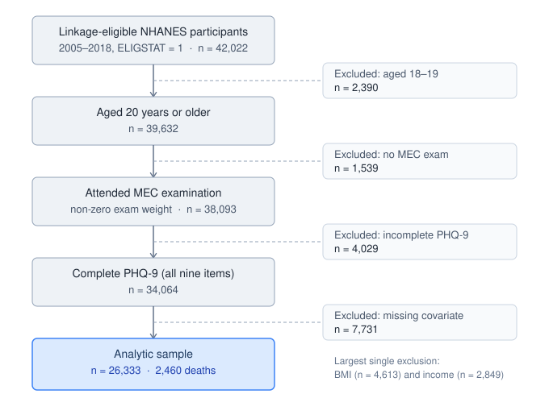

# PHQ-9 Depression Severity and All-Cause Mortality
### Survey weighted Cox analysis of NHANES

**[report & results](https://kamyabbaris.github.io/nhanes-phq9-mortality/)**

## Status
**Complete.** Full pipeline — data acquisition through an adjusted, proportional-hazards-checked Cox model and a propensity-score sensitivity analysis — validated end-to-end and reproducibility-tested (see below).

**Plumbing validated (13 Aug 2026)**: the full pipeline reproduces a published NCHS benchmark exactly. Applying the survey design and PHQ-9 scoring to NHANES 2013-2016 (ages 20+) yields 8.1% weighted prevalence of PHQ-9 >=10, matching Brody, Pratt & Hughes (2018), NCHS Data Brief No. 303, to the reported decimal. See `R/07_validation.R`.

## Research question
Does PHQ-9 defined depression severity predict all-cause mortality in the US adult population, after accounting for the complex NHANES survey design?

## Data
- NHANES demographic, questionnaire (PHQ-9), and MEC exam data --- Accessed via the R package `nhanesA`
- NCHS Public-Use Linked Mortality File (LMF) --- fixed width, joined on `SEQN`

**Cycle Range**: 2005-2006 through 2017-2018 (seven NHANES cycles). The range is bounded on both ends: PHQ-9 (`DPQ`) was first added to NHANES in the 2005-2006 cycle, and the public-use Linked Mortality File currently covers cycles only through 2017-2018 (follow-up through December 31, 2019). Pooling all seven maximizes death events for statistical power; the tradeoff is uneven follow-up length across entry cohorts (up to 180 months for 2005-2006 entrants vs. 37 months for 2017-2018), which the Cox model accommodates natively through right-censoring rather than requiring equal follow-up per person. Note that pooling widens the *entry* window, not the observation window — follow-up time comes from the mortality linkage, not from the number of cycles pooled.

**Linkage & eligibility**: Pooling all seven cycles yields 70,190 respondents. Of those, 42,022 (~60%) were mortality-linkage eligible (`ELIGSTAT==1`); the remainder were excluded because they were under 18 at the time of the exam (mortality data is not released for minors) or had insufficient identifying information for NCHS to attempt linkage to the National Death Index. Linkage-ineligible participants are dropped at the cohort-definition stage rather than treated as censored survivors, since no mortality status exists for them.

**Participant flow**: The linkage-eligible pool is not the analytic sample. Four further restrictions apply — age, MEC attendance, PHQ-9 completeness, and covariate completeness — reducing 42,022 to a final analytic sample of **26,333 participants with 2,460 deaths**:



The age restriction to 20+ is deliberate and matches the NCHS convention used in the validation benchmark, so the validation and the primary analysis run on the same population. PHQ-9 is administered from age 18, so this drops 18- and 19-year-olds.

**Data is not included in this repository.** The LMF's NCHS data-use terms prohibit redistribution. To reproduce:
1. `R/01_download_data.R` pulls NHANES data directly via `nhanesA`
2. Request the LMF from NCHS and place it in `data/raw`

**PHQ-9 scoring**: Complete-case scoring, meaning all 9 items must be answered; if any single item is missing the total score is set to NA rather than prorated. Prorating would systematically deflate scores and misclassify respondents into milder categories — non-differential exposure misclassification that would attenuate the hazard ratios toward the null. `DPQ100` (a difficulty follow-up question) is excluded, as it is not part of the PHQ-9 instrument itself. Severity bands follow the standard PHQ-9 cutoffs: Minimal (0-4), Mild (5-9), Moderate (10-14), Moderately severe (15-19), Severe (20-27). In the analytic sample the distribution is strongly right-skewed (76.3% minimal, 0.9% severe), consistent with published PHQ-9 distributions in general (non-clinical) population samples.

**Missing data**: Complete-case analysis, pre-specified and applied explicitly in the model scripts rather than left to R's default `na.action`. The two missingness mechanisms are not equivalent and are treated separately in the limitations. Missingness in PHQ-9 items and MEC attendance is plausibly MNAR — depression severity itself drives non-attendance and item non-response — so multiple imputation would produce narrower intervals around a still-biased estimate rather than less bias. Covariate missingness, which is the larger loss (7,731 participants, dominated by BMI at 4,613 and family income ratio at 2,849), occurs among people who *did* complete the PHQ-9 and is plausibly closer to MAR; multiple imputation restricted to covariates is a documented next step rather than a claim about the current estimates.

The direction of MNAR bias cannot be formally signed. The most plausible mechanism — healthy-participant selection removing proportionally more frail individuals from the severe category than from the reference category — would attenuate the hazard ratios, making the reported estimates more likely a floor than a ceiling. This is a reasoned argument from an unobservable mechanism, not a bound.

**Survey design**: `svydesign` uses the MEC exam weight (`WTMEC2YR`), divided by 7 to account for pooling seven cycles. `WTMEC2YR` rather than the interview weight because PHQ-9 is collected during the MEC exam, not the household interview. Before combining cycles, `SDMVSTRA` was confirmed to be globally unique across all seven cycles (no stratum number is reused between cycles), so cycles could be pooled directly without constructing a combined cycle+stratum identifier. The resulting design has 214 clusters, consistent with NCHS's standard masked-variance convention of ~2 PSUs per stratum (101 strata with 2 PSUs, 4 strata with 3, confirmed directly against the data). All restrictions are applied via `subset()` on the design object rather than by filtering rows out of the data frame, which preserves the sample structure required for correct variance estimation.

NCHS's own documentation for each DPQ data file confirms the weight choice directly: MEC participants were the ones eligible for the depression screener, and the documentation specifies the full sample 2-year MEC exam weights for analysing these data (e.g. https://wwwn.cdc.gov/Nchs/Data/Nhanes/Public/2005/DataFiles/DPQ_E.htm).

## Data quality note

`BMDSTATS`, the NHANES body-measures completeness flag, is returned by `nhanesA` as a labelled factor in six of the seven cycles but as raw numeric codes (1–4) in the 2011-2012 cycle. An earlier version of the covariate script compared this variable against string labels only, which silently assigned `NA` to every 2011-2012 participant's BMI and excluded the entire cycle from the model — 4,631 participants and roughly 350 deaths, with no error or warning at any point.

The label text also varies between cycles for the same category ("Partial:  Height and weight obtained" in 2005-2006 versus "Partial:  Only height and weight obtained" in 2013-2014), a second silent-failure mode of the same kind.

The fix normalises `BMDSTATS` to character before comparison. Recovering the missing cycle moved the headline hazard ratio from 1.64 to 1.75 and left the dose-response shape unchanged, which is reassuring about the stability of the finding but says nothing about how easy the bug was to miss. Both issues are the same failure mode as the education-label inconsistency already handled by `educ_map` in `R/05_build_analytic_dataset.R`; the difference is that a factor-level mismatch surfaces as visibly wrong output, while a failed string match silently produces `NA`.

## Reproducing this analysis
```bash
git clone <repo-url>
cd nhanes-phq9-mortality
R -e "renv::restore()"
quarto render reports/analysis.qmd
```
or you can run the whole pipeline in one command (as of 26/08/2026):
```bash
Rscript run_all.R
```

**Verified (26 August 2026)**: a full clean run of all twelve scripts (`R/00_setup.R` through `R/13_sensitivity_propensity.R`), executed in numeric order on a fresh R session with no manual intervention, reproduces every reported result exactly (the 42,022-person eligible cohort, the 26,333-participant analytic sample, the 8.1% published benchmark match, the 214-cluster survey design, and both the primary and sensitivity Cox model hazard ratios).

## Method (brief)
- **Design**: retrospective cohort constructed from a cross-sectional survey linked to mortality records; time zero is the MEC exam date, so exposure measurement and start of follow-up coincide and no immortal time is accrued
- **Survey design**: `svydesign`, combining NHANES cycles with MEC exam weights divided across the number of pooled cycles
- **Exposure**: PHQ-9 severity category (Minimal = reference)
- **Outcome**: all-cause mortality; everyone still alive is administratively censored at 31 December 2019, so censoring is non-informative by construction
- **Model**: survey-weighted Cox proportional hazards (`svycoxph`, `survey` package)
- **Sensitivity**: propensity-score-weighted model (secondary, optional --- not part of the core scope)

## Results

**Adjusted Cox proportional hazards model** (n = 26,333; 2,460 deaths), PHQ-9 severity vs. all-cause mortality, adjusted for age (stratified — see Proportional Hazards Check below), sex, race/ethnicity, education, marital status, income ratio, BMI, smoking status, diabetes, and CVD:

| PHQ-9 category (vs. Minimal) | HR | 95% CI | p | participants |
|---|---|---|---|---|
| Mild (5–9) | 1.22 | 1.06–1.41 | 0.006 | 4,061 |
| Moderate (10–14) | 1.28 | 1.03–1.59 | 0.028 | 1,376 |
| Moderately severe (15–19) | 1.86 | 1.33–2.61 | <0.001 | 560 |
| Severe (20–27) | 1.19 | 0.63–2.22 | 0.596 | 236 |

A clear, largely monotonic dose-response can be seen from Mild through Moderately severe. The Severe category's lower point estimate and loss of significance reflects the small number of participants (236) and the correspondingly small number of deaths in that cell, rather than a genuine reversal of the trend: with few events the partial likelihood is nearly flat along that coefficient, so the data do not discriminate between an HR of 1.2 and one of 2.2. The confidence interval is roughly twice as wide as Moderately severe's, consistent with an underpowered subgroup rather than a true ceiling effect. The point estimate in that category should not be interpreted on its own.

Full model output: `docs/cox_model_v2_hr_table.html`. See `R/11_cox_model.R`.

**Note**: `svycoxph()` requires explicit exclusion of zero-weight rows before fitting (a documented package-level requirement, not specific to this dataset). Zero MEC exam weight also serves as the operational definition of MEC non-attendance in this pipeline. For more, see script comments.

**Proportional hazards check**: `cox.zph()` on the survey-weighted model produced degenerate results (chi-square values near zero, p ~ 1 for every covariate). `cox.zph()` is documented and tested against plain `coxph()` fits rather than `svycoxph()`, which is the likely cause. As a workaround, a parallel `coxph()` model was fitted to the same complete-case data using case weights normalized to the real sample size — raw survey weights are misinterpreted by `coxph()` as literal row-duplication counts and inflate the test statistics to absurd values. This diagnostic-only model found a clear violation for age (χ² = 26.77, p = 2.3e-07) and weaker violations for sex (p = 0.022) and CVD (p = 0.045). Critically, PHQ-9 category itself showed no evidence of violation (p = 0.309), so the exposure of interest satisfies the assumption.

Age was then stratified (`strata(age_group)`, four bands) in a refit of the primary model, since its violation was by far the largest and a stratified variable no longer requires an assumed-constant hazard ratio. The cost is that no hazard ratio is estimated for age itself. Sex and CVD's more modest violations are noted as a limitation rather than remedied, to avoid over-fragmenting the model's risk sets. The headline PHQ-9 hazard ratios are materially unchanged after this correction (Moderately severe: 1.75 → 1.86), indicating the primary finding is not sensitive to this modeling choice.

See `R/12_cox_ph_check.R`; final model: `docs/cox_model_v2_hr_table.html`.

### Sensitivity analysis: propensity-score weighting vs. direct adjustment

As a robustness check, PHQ-9 was collapsed to a binary "depression" exposure (score ≥ 10, matching the threshold validated against NCHS Data Brief 303) and compared under two different confounding-adjustment strategies:

| Method | HR | 95% CI | p |
|---|---|---|---|
| Direct adjustment (covariates in model) | 1.31 | 1.10–1.55 | 0.003 |
| Propensity-score weighting (IPTW, trimmed at 99th percentile) | 1.20 | 0.97–1.49 | 0.099 |

The two estimates are directionally consistent with substantially overlapping confidence intervals, supporting the robustness of the primary finding to the choice of confounding-adjustment method. The propensity-weighted estimate's borderline significance (CI lower bound 0.97) is consistent with IPTW's known lower statistical efficiency relative to direct adjustment, rather than a genuine disagreement between methods.

See `R/13_sensitivity_propensity.R`.

## Limitations

- **PHQ-9 is a screening instrument, not a diagnosis.** The exposure is self-reported symptom severity over the preceding two weeks, measured once at baseline. It is not clinician-assessed major depressive disorder, and it does not capture change in symptoms over follow-up.
- **Single baseline measurement.** Depression severity is treated as fixed at time zero. People move between severity categories over a follow-up period of up to fifteen years.
- **Ambiguous covariates.** BMI, smoking, and CVD are measured cross-sectionally at the same visit as the exposure, so they may lie on the causal pathway between depression and mortality rather than confounding it. A model without them would be a reasonable additional sensitivity analysis.
- **Reverse causation.** Undiagnosed serious illness at baseline could elevate both depressive symptoms and near-term mortality. Sensitivity analysis excluding early deaths is not currently implemented.
- **Cycle-correlated exclusion.** BMI completeness is substantially lower in the earliest cycles (2005-2006 and 2007-2008) than in later ones, so complete-case restriction draws the analytic sample disproportionately from later cycles.
- **Unremedied PH violations** for sex and CVD, as described above.
- **Association, not effect.** Nothing in this design supports a causal interpretation.

## Use of AI

An AI model (Anthropic, Sonnet 5) was used in this project in the cases listed below:
- I do not know html, so for the production of the "interactive" reports I got assistance from the model.
- Certain debugging tasks (e.g. the fixed-width to rds) required extensive debugging that I am not that familiar with, however I made sure to check every step throughout the debugging to make sure no errors were committed.
- The `BMDSTATS` cross-cycle coding bug described under Data quality was surfaced during a line-by-line review of the pipeline conducted with model assistance; the diagnosis, the fix, and the decision about which body-measures categories to retain are mine.

## License
MIT
